# Build Guide

## Parts

The following parts list has links to various shops. Please don't see this as an
endorsement for the shops, its just where I ended up ordering the things I used
to help you find the correct parts. I found it quite difficult to find screws
and spacers that will fit the tight build, for example.

| Name                       | Amount | Remarks                                                                       | Part                                 |
| :------------------------- | :----- | :---------------------------------------------------------------------------- | :----------------------------------- |
| PCB                        | 2      |                                                                               |                                      |
| Top plate                  | 2      |                                                                               |                                      |
| Bottom plate               | 2      |                                                                               |                                      |
| nice!nano                  | 2      |                                                                               | [nice!nano on nicekeyboards.com]     |
| 301230 LiPo battery        | 2      |                                                                               |                                      |
| Mill-Max Series 315 header | 4      |                                                                               | [headers on keycapsss.com]           |
| Mill-Max Series 315 pin    | 48     |                                                                               | [pins on keycapsss.com]              |
| Tactile switch             | 2      |                                                                               | [SS12D00]                            |
| Power switch               | 2      |                                                                               | [TS-1136-4.3]                        |
| Diode                      | 66     |                                                                               | SOD-123FL                            |
| Kailh Choc Hotswap Socket  | 66     |                                                                               | [Choc Type Hot Swap Socket]          |
| Key switch                 | 66     |                                                                               | PG1350, NOT Choc V2!                 |
| Keycaps                    | 66     | The Taira is NOT compatible with keycaps intended for 19x19mm switch spacing! | [MBK Choc Low Profile Blank Keycaps] |
| Spacer M2 4mm              | 16     |                                                                               | [brass round standoff, m2x4]         |
| Screw M2 3mm               | 32     |                                                                               | [m2x3 screw]                         |
| Cushion rubber feet        | 28     | I had to stack two 1mm cushion rubbers to be higher than the screws, so 7x2x2 | [adhesive rubber feet 1mm]           |
| USB-C cable                | 1-2    | At least one for charging the battery, two during assembly                    |                                      |

[nice!nano on nicekeyboards.com]: https://nicekeyboards.com/nice-nano/
[headers on keycapsss.com]:
  https://keycapsss.com/keyboard-parts/parts/100/single-row-socket-headers-or-pins-mill-max-series-315?number=KC10067_header
[pins on keycapsss.com]:
  https://keycapsss.com/keyboard-parts/parts/100/single-row-socket-headers-or-pins-mill-max-series-315?number=KC10067_pins
[ss12d00]: https://aliexpress.com/item/4000770828576.html
[ts-1136-4.3]: https://aliexpress.com/item/1068908059.html
[choc type hot swap socket]:
  https://www.kailhswitch.com/mechanical-keyboard-switches/box-switches/choc-type-hot-swap-socket.html
[mbk choc low profile blank keycaps]:
  https://keycapsss.com/keyboard-parts/keycaps/169/mbk-choc-low-profile-blank-keycaps?number=KC10130_1U-WH
[brass round standoff, m2x4]: https://aliexpress.com/item/32968906213.html
[m2x3 screw]: https://www.amazon.de/gp/product/B00W96Z5RQ
[adhesive rubber feet 1mm]: https://www.amazon.de/gp/product/B06WRQ471S

## Printing the PCBs and plates

Download the gerber files from the [latest release](https://github.com/strayer/taira-keyboard/releases/latest).

These were exported from KiCad to be printed by JLC PCB. Check your PCB fab for
their requirements and maybe export new gerber files with KiCad yourself.

## Firmware preparation

Download the latest firmware from [strayer/taira-keyboard-zmk-config], you will
need it later to test the nice!nanos during the build process.

[strayer/taira-keyboard-zmk-config]:
  https://github.com/strayer/taira-keyboard-zmk-config

## Building

Decide which of the PCBs should be the left and right side. You will have to
solder some things to the back side and front side, so find a way to keep track
on which side you are currently working.

### Diodes

First, solder the diodes to the PCB.

The diodes **MUST** be attached to the bottom side of the PCB! Not all diodes
are directed in the same way, so keep an eye on the arrow markings on the PCB
silkscreen to orient the diodes in the right direction.

The orientation of the diode is as follows: Attach the chip component so that
the "|||" mark on the diode is facing the "|" of the diode mark "|◁" on the PCB.

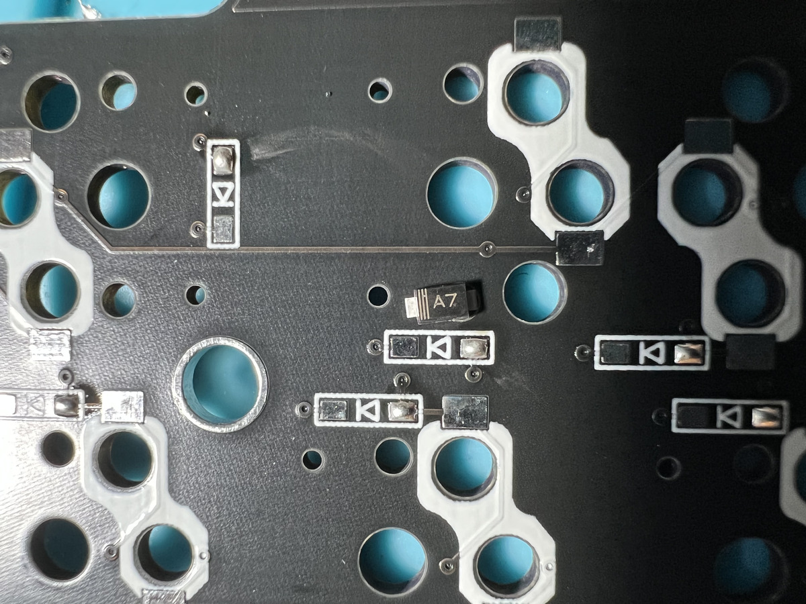

Prepare the PCB by putting solder on the right pad of all diode spots. Next,
solder the diodes by melting the solder on the PCB while holding them on the
pad.

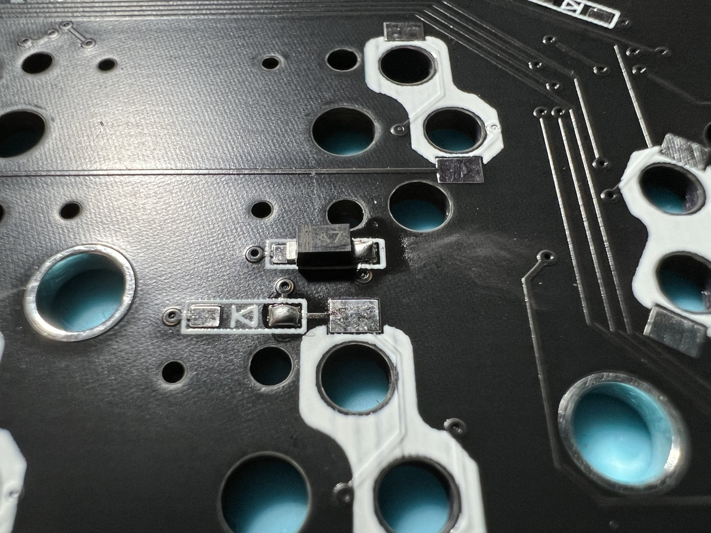

Continue with soldering the other side of the diodes to the PCB.

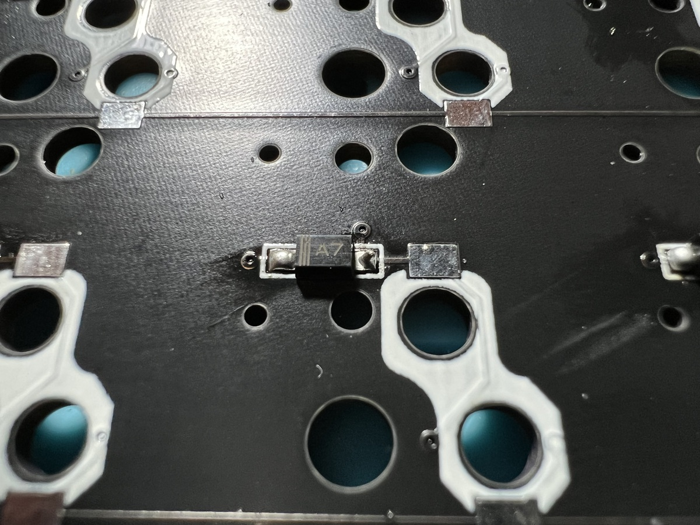

### Power and reset switch

Solder the power switch and reset switch to the **FRONT** of the PCB. The
orientation of both components doesn't matter.

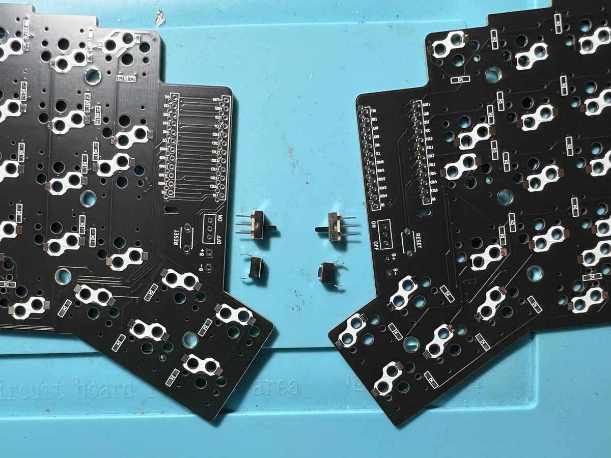

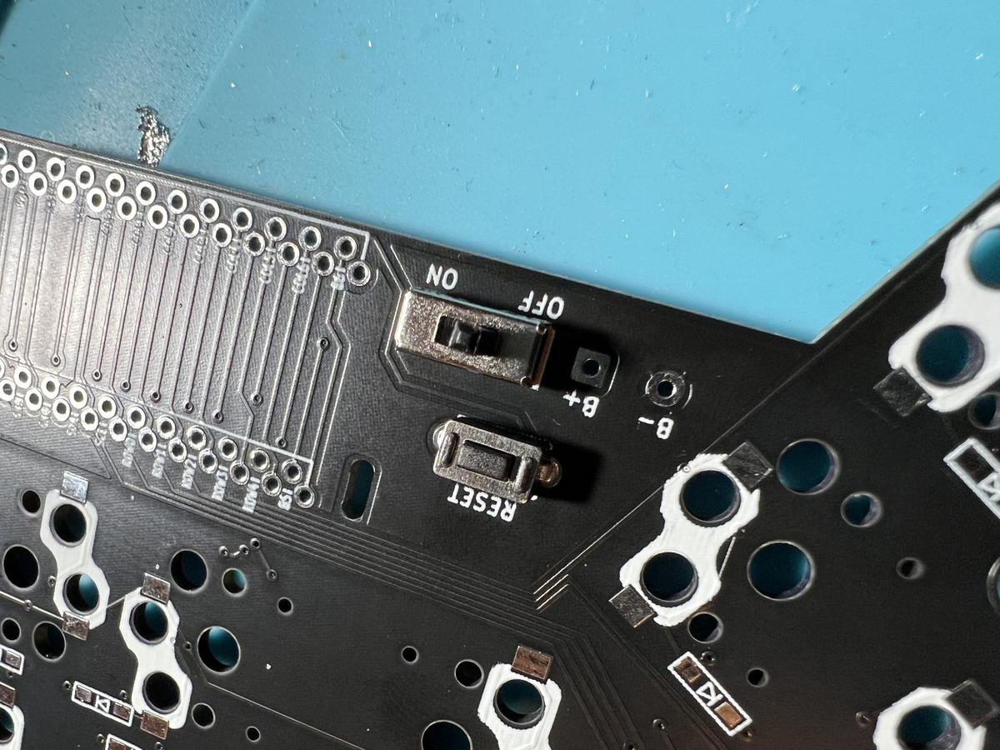

Clip the legs to avoid conflicts with the bottom plate.

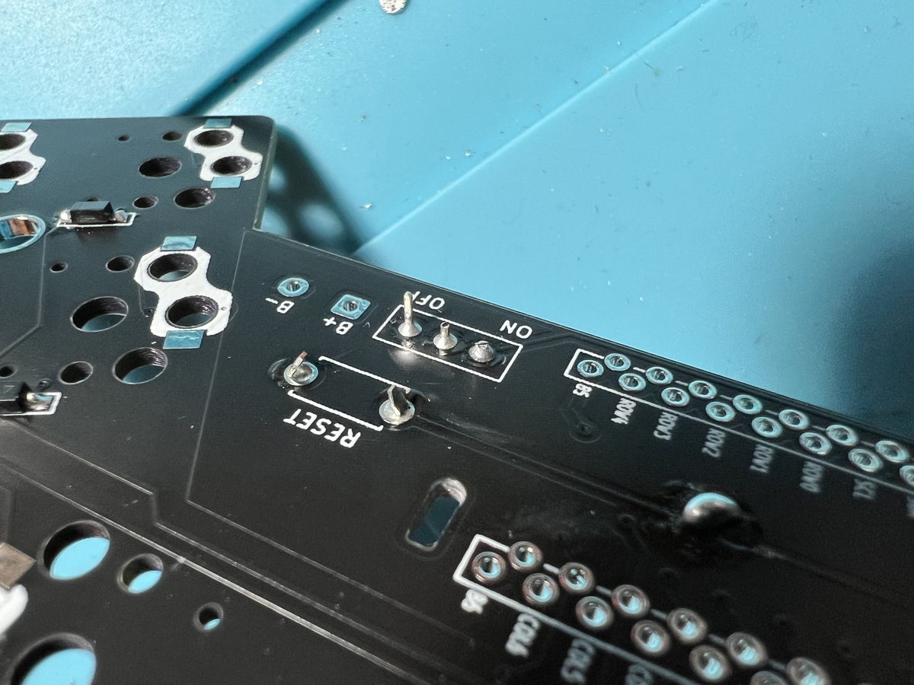

### nice!nano

Solder the sockets for the nice!nano to the **FRONT** of the PCB. The correct
holes for the left and right PCB are marked with a white frame.

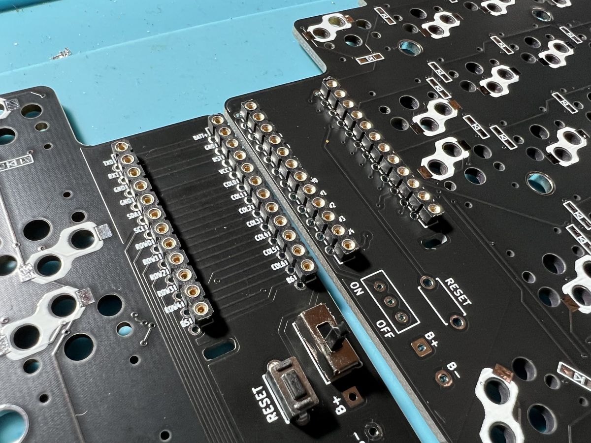

**IMPORTANT**: Check that you didn't short the pins of the nice!nano by
accident! Due to the flippable PCB design it is easy to make a solder bridge
between the front and bottom socket hole and create shorts.

Solder the MillMax pin legs to the nice!nano. **IMPORTANT**: The side of the
nice!nano with the silkscreen markings, components and LEDs must be on top!
There are various guides on how to do this, one is linked in the documentation
of the nice!nano itself:
[nicekeyboards.com: Socketing the nice!nano](https://nicekeyboards.com/docs/nice-nano/getting-started#socketing-the-nicenano)

I did this by putting kapton tape over the two socket rows, inserting the
millmax pins or diode legs in each hole, putting the nice!nano on top of it and
soldering the pins in place.

Note: I recommend using MillMax pins instead of leftover diode legs as described
in some guides. I tried both and the MillMax pins are _much_ more sturdy. It is
**VERY** easy to bend the pins and rip a nice!nano with diode legs out of the
sockets just by picking up the board while it is charging via USB-C.

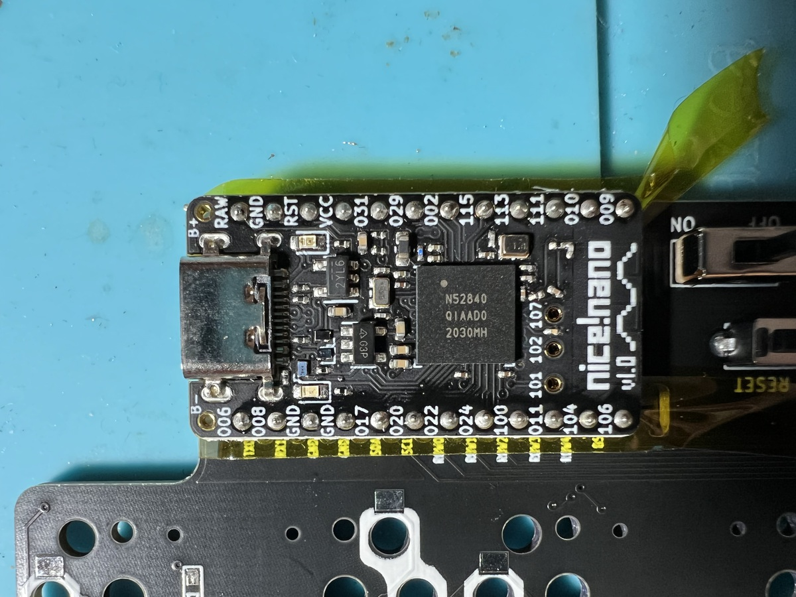

### Operation check

Put the nice!nano in the sockets and attach it to your computer with a USB-C
cable. Flash the left and right firmware as described in the ZMK documentation
to the respective nice!nanos. Afterwards only the left side needs to be
connected to the computer, the right side will connect to the left side via
Bluetooth as long as it has power through USB-C. If everything is working
correctly you should be able to simulate key presses by shorting the hotswap
sockets solder pads. Also try pressing the reset buttons to check if the
nice!nanos reset as expected (the blue LED should flash).

### Kailh Hotswap Sockets

Solder the Kailh Hotswap Sockets the same way you did the diodes, also on the
**BACK** of the PCB. The correct spots are again marked with white silkscreen.
Put solder on the right pad of all hotswap socket spots, put the socket into
position and hold it down with tweezers while melting the solder through the
metal part of the socket. Afterwards heat up the left metal part of the socket
and solder it on the pad.

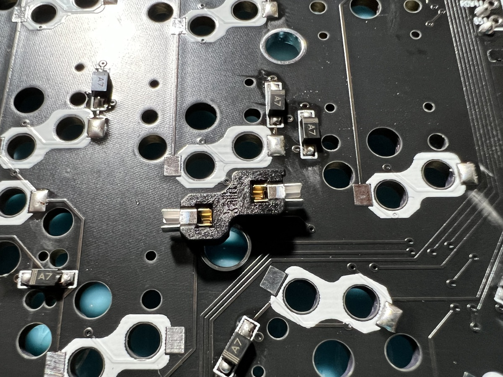

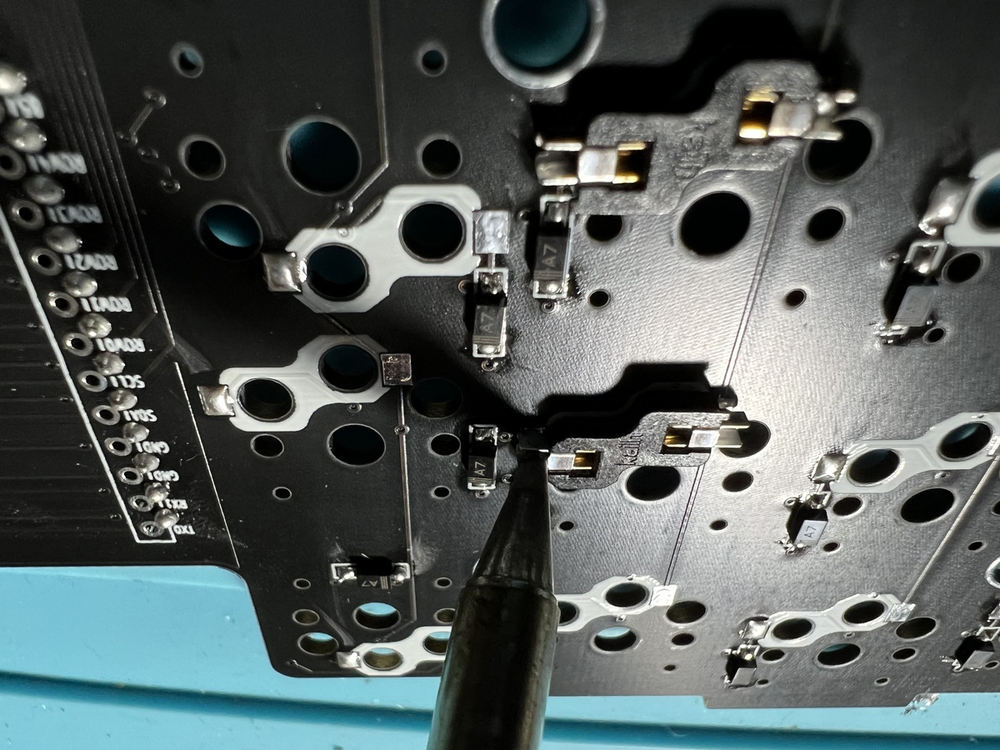

The fourth socket in the bottom row can be put in two different positions. You
can either have four switches next to each other to have HJKL-like arrow keys or
have the switch a bit further to the center to make it easier to reach it with
your thumb. You can also solder hotswap sockets to both positions if you want to
be able to switch positions later. The default keymap is intended to be used
with the thumb on the left side (mapped to Alt) and as arrow keys on the right
side (mapped to ←↓↑→).

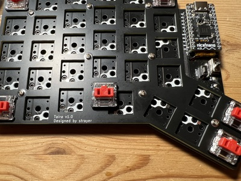
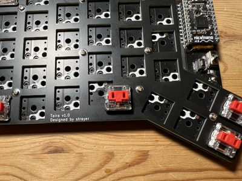

### Batteries

First remove the nice!nano from the socket and make sure the power switch is set
to OFF. Place the battery between the sockets for the nice!nano. Guide the wires
through the hole in the PCB to the back side and solder them into the B+ and B-
holes there. Measure the voltage if you are unsure which wire is positive and
negative. Be extra careful to NOT short the battery terminals/wires! I opted to
secure the wires and soldering spots with kapton tape. I also put kapton tape on
the back of the nice!nano to avoid it touching the battery directly, although
this is probably unnecessary.

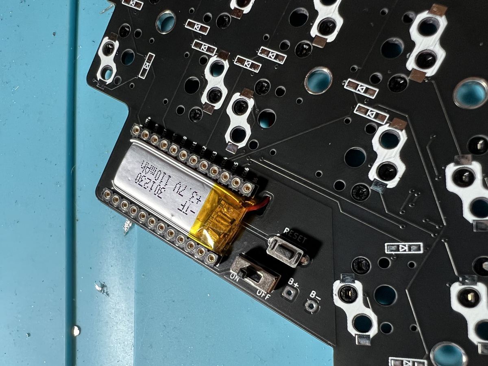
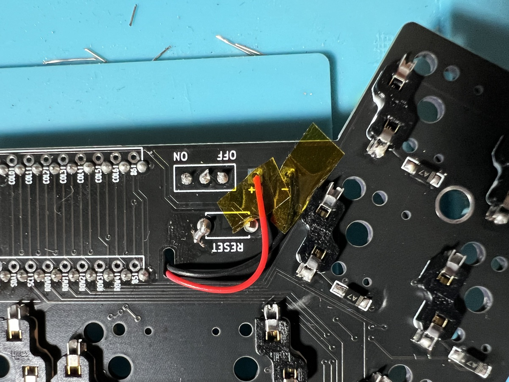

Put the nice!nano back into the socket and flip the power switch. Make sure the
LEDs on the nice!nano light up to test the connection. (Note: This may not work
when the battery is discharged)

A new Bluetooth device named "Taira" should appear on your device after turning
on the power switch. Try to connect to it and short the hotswap sockets again to
test, ideally with both sides turned on.

### Top and bottom plates

Take a top plate and put a 3mm screw from the top through the hole and screw on
a spacer, repeat this for every hole. Guide the spacers through the assembled
PCB, place the bottom plate on it and secure it with a 3mm screw in each hole.
The distance between the PCB and the top plate should be so that an inserted
switch is supported by the top plate while still touching the PCB.

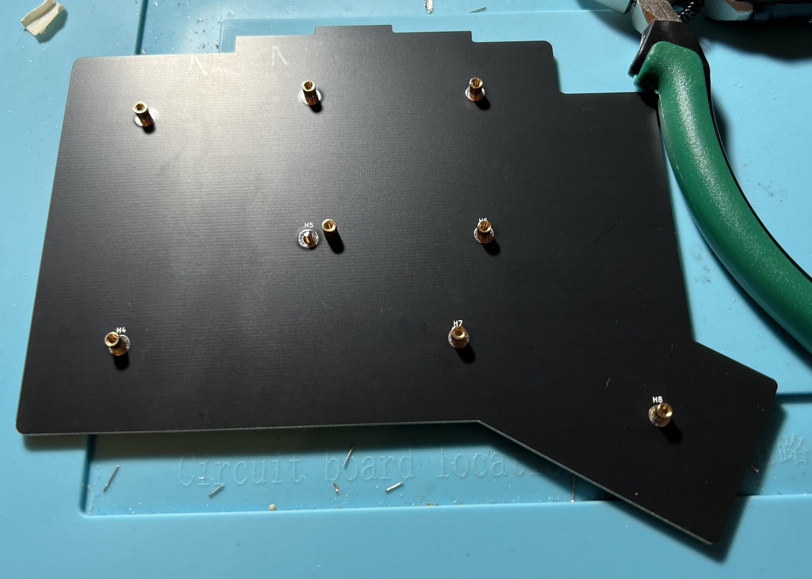
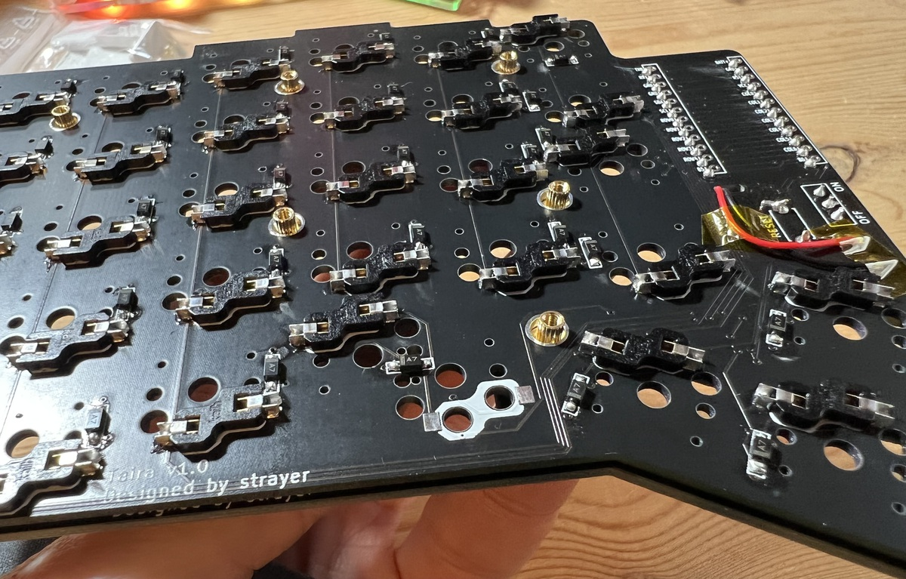
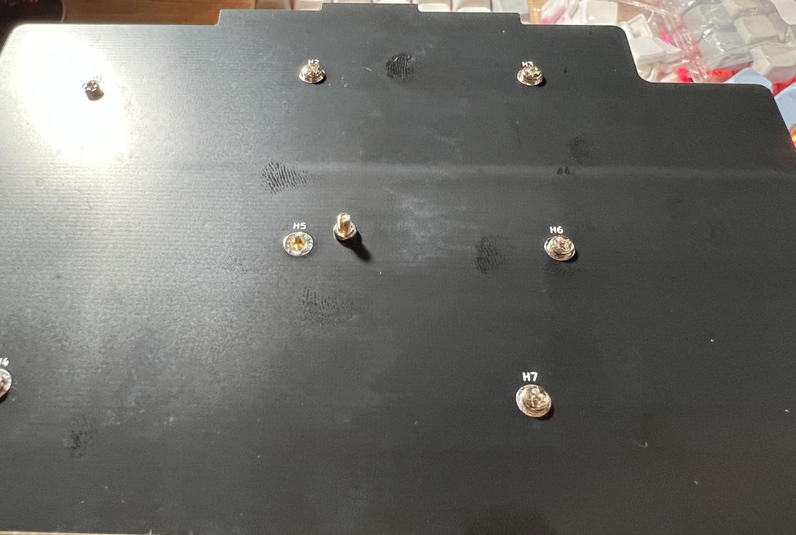

Add some rubber pads / feet to the bottom plate to reduce noise while typing and
avoid sliding.

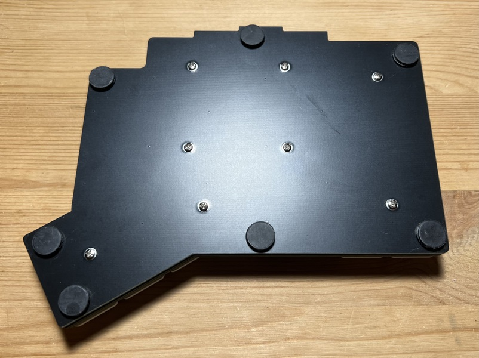

### Switches

Gently insert each Kailh Choc switch into the hotswap sockets. It will require
some force, but keep in mind that it _is_ possible to lift off the socket pad if
using too much force or changing switches too often.

If required, push the top plate up to the switch support with a screwdriver.

Finally, attach the keycaps.

### Conclusion

Congratulations! You successfully built a Taira keyboard!

I'd love to get feedback on the build process and the keyboard itself - feel
free to e-mail me at [strayer@olle-orks.org](mailto:strayer@olle-orks.org) or
[start a discussion on Github](https://github.com/strayer/taira-keyboard/discussions)!

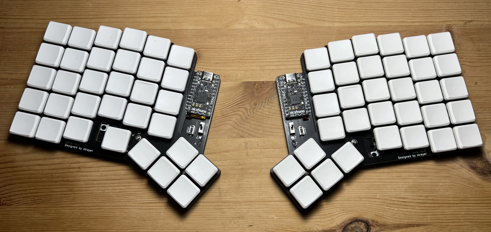
